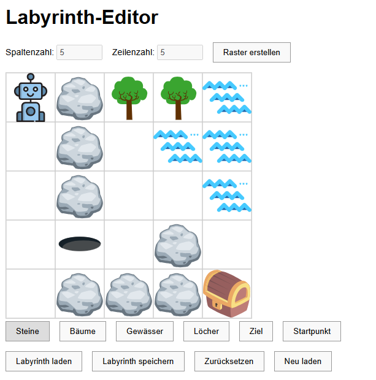

# 🧱 Robby-Labyrinth-Editor

Der Editor für Robby. Hier kannst Du eigene Labyrinthe für [Robby](https://github.com/ToniTaste/Robby) entwickeln. 

## 🔍 Funktionen

- Grafischer Editor zum Bau des Labyrinths bestehend aus Steinen, Bäumen, Wasserstellen, Löchern, einem Roboter und einer Schatzkiste
- Speichern/Laden des Labyrinths für den Editor und für Robby

## 🖼️ Screenshot



## 🚀 Online ausprobieren

> Wird unterstützt durch **GitHub Pages**.

👉 [Hier klicken, um das Projekt direkt im Browser zu starten](https://tonitaste.github.io/Robby-Edit/)

## 📦 Installation (lokal)

Du kannst das Projekt lokal starten, indem du die Dateien einfach in einen Ordner speicherst und `index.html` in einem Browser öffnest:

```bash
git clone https://github.com/ToniTaste/Robby-Edit.git
cd Robby-Edit
# Dann: index.html im Browser öffnen
```

## Grafikquellen
Vectors and icons by <a href="https://www.svgrepo.com" target="_blank">SVG Repo</a>
- robot.svg - COLLECTION: Universe 17, LICENSE: CC0 License, UPLOADER: SVG Repo
- rock.svg - COLLECTION: Twemoji Emojis, LICENSE: MIT License, AUTHOR: Twitter
- hole.svg - COLLECTION: Fxemoji Emojis, LICENSE: Apache License, AUTHOR: Mozilla
- treasure.svg - COLLECTION: Lechazo Conf Flat Vectors, LICENSE: CC Attribution License, AUTHOR: lechazoconf
- tree.svg - COLLECTION: Tree Variations Flat Icons, LICENSE: CC0 License, UPLOADER: SVG Repo
- waves.svg - COLLECTION: Symbol, LICENSE: CC0 License, UPLOADER: SVG Repo
